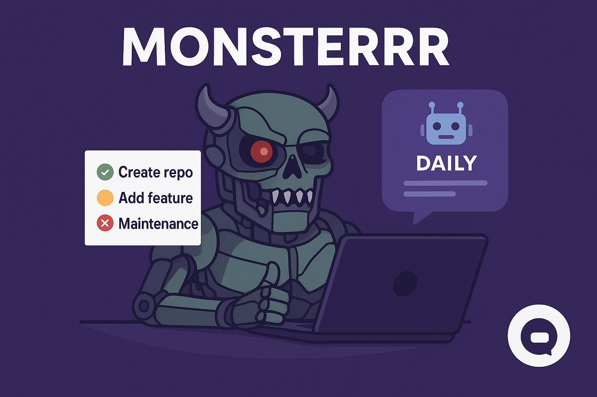

# Monsterrr

## 🚀 Autonomous AI for GitHub Organization Management

---

## 🚀 Render Deployment Instructions

Monsterrr is production-ready for Render. To deploy:

1. **Connect your GitHub repo to Render.**
2. **Add environment variables** from `.env` to Render's dashboard (never commit secrets).
3. **Ensure your repo contains:**
   - `Procfile` (web and worker entries)
   - `render.yaml` (web and worker services)
   - `requirements.txt`
   - All source code in the repo root.
4. **Render will auto-detect and run:**
   - FastAPI API (`web`): `uvicorn main:app --host 0.0.0.0 --port 8000`
   - Discord bot (`worker`): `python -m services.discord_bot_runner`

**No manual intervention required.**

For local development, use:
```powershell
set PYTHONPATH=C:\Projects\Monsterrr
python -m honcho start
```

---

## 🐳 Docker Deployment (All-in-One Mode)

Monsterrr can also be deployed using Docker with a single container that runs all services:

1. **Build the Docker image:**
   ```bash
   docker build -t monsterrr .
   ```

2. **Run with all services in one container:**
   ```bash
   docker run -p 8000:8000 -e START_MODE=all monsterrr
   ```

This mode runs all worker processes in the background and displays only the web server output in the terminal.

**Test Results:**
- ✅ Server starts and binds to port 8000
- ✅ Health check endpoint returns 200 OK with status information
- ✅ Worker processes run in background without cluttering terminal output
- ✅ Web server output is clearly displayed with startup information
- ✅ Memory usage is properly reported (81.06 MB in tests)

Example health check response:
```json
{
  "status": "healthy",
  "timestamp": "2025-09-27T17:47:05.418395",
  "memory_usage_mb": 81.06,
  "port": "8000"
}
```

---

## 🔄 Startup Modes

Monsterrr supports multiple startup modes to suit different deployment needs:

| Mode | Description | Usage |
|------|-------------|-------|
| `web` | Web server only | `START_MODE=web python start_monsterrr.py` |
| `worker` | Worker processes only | `START_MODE=worker python start_monsterrr.py` |
| `hybrid` | Both web and worker in single process | `START_MODE=hybrid python start_monsterrr.py` |
| `all` | All services with workers in background | `START_MODE=all python start_monsterrr.py` |

The `all` mode is recommended for Docker deployments as it provides the cleanest terminal output while running all services.

---

## 🧠 Advanced Groq Model Management

Monsterrr now supports intelligent model selection for different tasks with automatic fallback for rate limiting:

### Task-Specific Models
- **Complex Tasks**: `openai/gpt-oss-120b` and `llama-3.3-70b-versatile`
- **Balanced Tasks**: `llama-3.1-8b-instant` and `openai/gpt-oss-20b`
- **Fast Tasks**: `llama-3.1-8b-instant` (optimized for speed)

### Rate Limit Handling
- Automatic fallback to alternative models when rate limits are hit
- Intelligent wait time calculation based on API response headers
- Exponential backoff for server errors
- Comprehensive error logging and recovery

### Available Models
1. `openai/gpt-oss-120b` - Flagship model for complex reasoning
2. `llama-3.3-70b-versatile` - High-performance alternative
3. `llama-3.1-8b-instant` - Fast and efficient for general tasks
4. `openai/gpt-oss-20b` - Good balance of speed and capability

---

## 📧 Enhanced Email Reporting

Monsterrr now features improved email reporting with:

### Professional Reports
- Beautiful HTML-formatted status reports
- Plain text fallback for compatibility
- Comprehensive activity summaries
- Recent actions and idea tracking

### Reliable Delivery
- Enhanced SMTP connectivity checking
- Better error handling and logging
- Automatic report sending on startup and daily
- Configuration validation at startup

### Report Content
- Repository statistics and organization metrics
- Recently executed actions and contributions
- Top generated ideas with technical details
- System health and performance indicators

### One-Time Messaging
- **Startup Messages**: Discord startup messages and emails are sent only once
- **Daily Reports**: Email reports are sent only once per day
- **State Tracking**: All message states are tracked in `monsterrr_state.json`
- **Persistent State**: Message history is preserved across restarts

---

## 📡 Discord Integration

Monsterrr's Discord bot provides real-time communication and control:

### Smart Messaging
- **One-Time Startup**: Discord startup messages are sent only once per system start
- **Daily Reports**: Daily status reports sent automatically once per day
- **Activity Tracking**: Real-time updates on system activities and contributions
- **Command Interface**: Full control through natural language commands

### Features
- All Monsterrr features accessible via Discord commands
- Web search from Discord with `!search <query or url>`
- Natural language support for conversational interactions
- Professional responses using rich Discord embeds
- Real-time alerts, polls, and executive reports

---

Monsterrr is a multi-agent, production-ready system that discovers, creates, and maintains open-source projects for your GitHub organization. Powered by Groq LLM, Monsterrr automates daily planning, contribution execution, and professional reporting—keeping your org healthy and growing 24/7.

---


## Features

- **Web Search & Summarization:** Instantly search the web from Discord using `!search <query or url>` or natural language. Monsterrr fetches, crawls, and summarizes results like ChatGPT.
- **AI-Driven Daily Planning:** Plans and executes exactly 3 meaningful contributions per day (repo creation or feature branch).
- **Multi-Agent Architecture:** Includes MaintainerAgent, CreatorAgent, and IdeaGeneratorAgent for full org automation.
- **Professional Daily Status Reports:** Sends quantifiable, transparent email reports with all ideas, actions, and metrics.
- **Audit Logging:** All actions and plans are saved for review and compliance.
- **Production-Ready:** Robust error handling, `.env`-only config, and seamless deployment to Render or Docker.
- **Enhanced Brainstorming:** AI-powered idea generation with detailed technical specifications.
- **Complete Code Generation:** Creates repositories with fully functional code, not just boilerplate.
- **Advanced Repository Management:** Improves existing repositories with new features and enhancements.
- **Comprehensive Reporting:** Detailed status reports via email and Discord.

---

## Advanced Features
- **Conversation Memory:** Remembers previous user interactions for context-aware responses and follow-up actions.
- **Task Assignment & Tracking:** Assigns tasks to contributors, tracks progress, and sends reminders via Discord and email.
- **Automated Issue & PR Triage:** Uses AI to label, prioritize, and assign issues/PRs automatically.
- **Project Roadmap Generation:** Generates and updates project roadmaps based on org goals and activity.
- **Contributor Recognition:** Sends automated thank-you messages, badges, or highlights for top contributors.
- **Weekly/Monthly Executive Reports:** Summarizes org activity, contributions, and metrics in professional reports.
- **Real-Time Alerts:** Notifies on critical events (security, failed CI, stale PRs) in Discord and email.
- **Idea Voting & Polls:** Lets users vote on new ideas or features directly in Discord.
- **Automated Documentation Updates:** Uses AI to update README, changelogs, and contributor guides.
- **Customizable AI Agents:** Allows users to create and configure new agents for specific org needs.
- **Integration with Other Platforms:** Slack, Trello, Jira, Notion, etc. for cross-platform org management.
- **Scheduled Q&A Sessions:** Hosts regular Q&A or office hours in Discord, powered by AI.
- **Advanced Analytics Dashboard:** Visualizes org health, contributions, and trends via web or Discord embeds.
- **Auto-merge & Auto-close Rules:** Smart rules for merging PRs or closing issues based on org policies.
- **Onboarding Automation:** Guides new contributors with personalized onboarding messages and tasks.
- **Custom Command Builder:** Lets users define new commands and workflows via Discord.
- **Security & Compliance Monitoring:** Scans repos for secrets, vulnerabilities, and compliance issues.
- **AI-Powered Code Review:** Provides feedback and suggestions on PRs using LLMs.
- **Multi-language Support:** Responds and operates in multiple languages for global teams.
- **Voice Command Integration:** Uses Discord voice channels for spoken commands and responses.

---

## Quick Start
1. **Clone & Install**
   ```sh
   git clone https://github.com/ni-sh-a-char/Monsterrr.git
   cd Monsterrr
   pip install -r requirements.txt
   ```
2. **Configure `.env`**
   - Create a `.env` file in the project root with the following fields:
   
   ```ini
   # ==== Groq API ====
   GROQ_API_KEY=sk-...         # Your Groq API key
   GROQ_MODEL=openai/gpt-oss-120b  # Groq model name (default: openai/gpt-oss-120b)
   GROQ_TEMPERATURE=0.2        # (Optional) Model temperature
   GROQ_MAX_TOKENS=2048        # (Optional) Max tokens for Groq responses

   # ==== GitHub ====
   GITHUB_TOKEN=ghp_...        # Your GitHub Personal Access Token (with repo/org permissions)
   GITHUB_ORG=your-org-slug    # Your GitHub organization name (slug)

   # ==== Email (SMTP) ====
   SMTP_HOST=smtp.gmail.com    # SMTP server host (e.g., smtp.gmail.com)
   SMTP_PORT=587               # SMTP server port (e.g., 587 for TLS)
   SMTP_USER=your-email@gmail.com   # Your email address (sender)
   SMTP_PASS=your-app-password     # SMTP password or app password

   # ==== Status Reports ====
   STATUS_REPORT_RECIPIENTS=you@example.com,teammate@example.com  # Comma-separated list of recipient emails

   # ==== Daily Activity Mode ====
   DAILY_ACTIVITY_MODE=enabled   # enabled/disabled (default: enabled)
   DRY_RUN=false                 # true for dry-run mode (logs only, no actions)
   MAX_AUTO_CREATIONS_PER_DAY=3  # Number of contributions per day (default: 3)
   
   # ==== Discord ====
   DISCORD_BOT_TOKEN=your-bot-token
   DISCORD_GUILD_ID=your-guild-id
   DISCORD_CHANNEL_ID=your-channel-id
   ```

   - **Fill in each field with your actual credentials and settings.**
   - The default LLM model is now `openai/gpt-oss-120b`. You can change this in your `.env` if needed.
   - For Gmail, use an App Password (not your main password) and enable 2-Step Verification.
   - For GitHub, use a token with `repo` and `org` permissions.
   - You can add multiple emails to `STATUS_REPORT_RECIPIENTS` for team reports.
3. **Run Locally**
   ```sh
   uvicorn main:app --host 0.0.0.0 --port 8000
   ```
4. **Deploy to Render**
   - Connect your repo on Render.
   - Add all `.env` variables in the dashboard.
   - Use start command:
     ```sh
     uvicorn main:app --host 0.0.0.0 --port 8000
     ```

---

## API Endpoints
- `/` — Service status
- `/health` — Health check
- `/status` — Current state file
- `/trigger/idea-agent` — Manual idea generation
- `/ideas/generate` — Generate and rank ideas
- `/repos/create` — Create repo for top idea
- `/run-agents` — Trigger all agents
- `/trigger/daily-plan` — Generate daily contribution plan
- `/trigger/execute-plan` — Execute daily plan
- `/trigger/maintenance` — Run maintenance tasks
- `/trigger/improve-repo` — Improve a specific repository
- `/trigger/brainstorm` — Generate new ideas

---

## Daily Automation & Reporting
- Scheduler runs daily at **00:00 UTC**
- Sends a professional status report email with:
  - Ideas proposed
  - Contributions planned/executed
  - Repositories created
  - Actions taken
  - Issues detected
- All actions are logged and auditable.

---


## Discord Integration: All Monsterrr Services via Commands

Monsterrr's Discord bot exposes every feature and service discussed, making your entire org manageable from Discord. All agents, automations, and analytics are available via professional, visually stunning commands and embeds.


### What You Can Do in Discord
- **All Monsterrr features are accessible:** Ideas, status, roadmap, tasks, triage, analytics, code review, security scan, onboarding, contributor recognition, custom commands, integrations, and more.
- **Web search from Discord:** Use `!search <query or url>` or just ask a question/paste a URL in chat. Monsterrr will search the web and summarize results like ChatGPT.
- **Natural language support:** Converse with Monsterrr, guide or override daily actions, and get context-aware responses.
- **Per-user memory:** The bot remembers your history for personalized help.
- **Professional responses:** All commands use rich Discord embeds for clarity and branding.
- **Real-time alerts, polls, and executive reports:** Stay updated and in control.

- `!guide` — Show all available commands and usage instructions.
- `!status` — Get current Monsterrr system status.
- `!ideas` — View top AI-generated ideas.
- `!search <query or url>` — Search the web and summarize results (works with both commands and natural language).
- `!roadmap <project>` — Generate a roadmap for a project.
- `!assign <user> <task>` — Assign a task to a contributor.
- `!tasks [user]` — View tasks for a user or all users.
- `!triage <issue|pr> <item>` — AI-powered triage for issues/PRs.
- `!recognize <user>` — Send contributor recognition.
- `!report [daily|weekly|monthly]` — Executive reports.
- `!alert <event>` — Send a real-time alert.
- `!poll <question> <option1> <option2> ...` — Create a poll.
- `!docs <repo>` — Update documentation for a repo.
- `!custom <instruction>` — Use a customizable AI agent.
- `!integrate <platform>` — Integrate with other platforms.
- `!qa <time>` — Schedule a Q&A session.
- `!analytics` — View analytics dashboard.
- `!merge <pr>` — Auto-merge a PR.
- `!close <issue>` — Auto-close an issue.
- `!onboard <user>` — Onboard a new contributor.
- `!scan <repo>` — Security scan for a repo.
- `!review <pr>` — AI-powered code review.
- `!language <lang> <text>` — Translate text to another language.
- `!voice <audio>` — Process a voice command.
- `!brainstorm <topic>` — Generate new project ideas.
- `!plan` — Generate daily contribution plan.
- `!execute` — Execute the daily plan.
- `!improve <repo>` — Improve an existing repository.
- `!maintain` — Run maintenance on all repositories.

**You can do anything with Monsterrr from Discord that you can do via the API or web.**

---

### Setup
1. **Add Discord Bot Credentials to `.env`**
   ```ini
   DISCORD_BOT_TOKEN=your-bot-token
   DISCORD_GUILD_ID=your-guild-id
   DISCORD_CHANNEL_ID=your-channel-id
   ```
2. **Invite the bot to your Discord server:**
   - Go to https://discord.com/developers/applications, create an app, add a bot, and copy the token.
   - Use the OAuth2 URL with 'bot' and 'message content' permissions to invite the bot to your server/channel.
3. **Install dependencies:**
   ```sh
   pip install -r requirements.txt
   ```
4. **Run Monsterrr:**
   ```sh
   python main.py
   ```
   The Discord bot will auto-start and operate in your specified channel.

### Discord Commands

**Core Commands:**
- `!guide` — Show all available commands and usage instructions.
- `!status` — Get current Monsterrr system status.
- `!ideas` — View top AI-generated ideas.
- `!contribute <instructions>` — Guide or override the 3 daily contributions (e.g., prioritize, skip, fix).
- `!fix <issue/pr>` — Suggest or apply a fix for a specific issue or PR.
- `!skip <repo/issue>` — Skip a repo or issue in the next contributions.

**Advanced Commands:**
- `!assign <user> <task>` — Assign a task to a contributor.
- `!tasks [user]` — View tasks for a user or all users.
- `!triage <issue|pr> <item>` — AI-powered triage for issues/PRs.
- `!roadmap <project>` — Generate a roadmap for a project.
- `!recognize <user>` — Send contributor recognition.
- `!report [daily|weekly|monthly]` — Executive reports.
- `!alert <event>` — Send a real-time alert.
- `!poll <question> <option1> <option2> ...` — Create a poll.
- `!docs <repo>` — Update documentation for a repo.
- `!custom <instruction>` — Use a customizable AI agent.
- `!integrate <platform>` — Integrate with other platforms.
- `!qa <time>` — Schedule a Q&A session.
- `!analytics` — View analytics dashboard.
- `!merge <pr>` — Auto-merge a PR.
- `!close <issue>` — Auto-close an issue.
- `!onboard <user>` — Onboard a new contributor.
- `!command <name> <action>` — Create a custom command.
- `!scan <repo>` — Security scan for a repo.
- `!review <pr>` — AI-powered code review.
- `!translate <lang> <text>` — Translate text to another language.
- `!voice <audio>` — Process a voice command.

**Enhanced Commands:**
- `!brainstorm <topic>` — Generate detailed project ideas with technical specifications.
- `!plan` — Generate a daily plan with concrete implementation tasks.
- `!execute` — Execute the daily plan with complete code generation.
- `!improve <repo>` — Enhance an existing repository with new features.
- `!maintain` — Run comprehensive maintenance across all repositories.

**Web Search & Natural Language:**
You can converse with Monsterrr in natural language, ask questions, or paste a URL. The bot will search the web and summarize results like ChatGPT, in addition to all other features. The `!search` command is also available for explicit queries.

---

## Contact & Support
For questions, issues, or contributions, open an issue or contact [ni-sh-a-char](mailto:piyushmishra.professional@gmail.com).

---

> **Monsterrr: Your autonomous, always-on GitHub organization manager.**